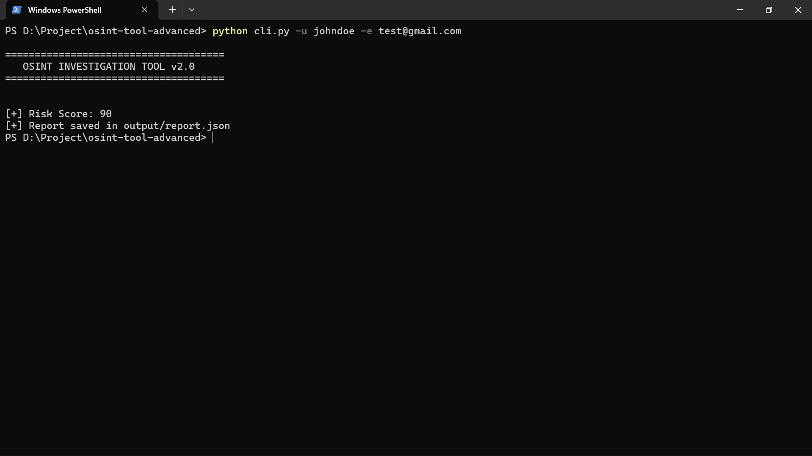

# 🔍 OSINT Investigation Tool (Advanced CLI + Dashboard)

<p align="center">
  
  
  
  
</p>

<p align="center">
  <b>Advanced OSINT tool for cybersecurity investigations with CLI & dashboard support</b>
</p>

---

## 🚀 Overview

This project simulates a real-world **OSINT (Open Source Intelligence) investigation workflow** used by SOC analysts and threat intelligence teams.

It performs:
- Username reconnaissance  
- Email intelligence analysis  
- Breach detection (simulated)  
- Risk scoring & profiling  
- Automated report generation  

---

## ⚡ Features

✔️ Username enumeration across multiple platforms  
✔️ Email metadata analysis (domain, provider, patterns)  
✔️ Simulated breach detection system  
✔️ Risk scoring engine (0–100)  
✔️ CLI interface (hacker-style output)  
✔️ JSON report generation  
✔️ Modular architecture (scalable design)  

---

## 📸 Screenshots

### 🔹 CLI Output


---

## ⚙️ Installation

```bash
git clone https://github.com/ankitvishwakarmavishwas/osint-tool-advanced.git
cd osint-tool-advanced
pip install -r requirements.txt
```
--- 

## ▶️ Usage
### 🔹 Run CLI Tool

```
python cli.py -u johndoe -e test@gmail.com

```

---

## 📊 Sample Output

```
{
  "risk_score": 80,
  "breaches": [
    {
      "breach": "Simulated Leak",
      "severity": "High"
    }
  ]
}

```

---

## 🧠 Architecture

```
osint-tool-advanced/
│
├── cli.py                # CLI interface
├── core/                # OSINT modules
├── engine/              # Orchestration & scoring
├── utils/               # Helpers
├── data/                # Sample datasets
├── output/              # Reports

```

---


## 🛠️ Tech Stack

Python

Requests

JSON

CLI (Argparse)


---


## 🎯 Use Cases

SOC Analyst training

Cybersecurity investigations

Threat intelligence gathering

Digital footprint analysis

OSINT research practice


---


## 🔒 Disclaimer

This tool is built for educational purposes only.

No real data scraping or unauthorized access is performed.

---

## 🚀 Future Improvements

Real OSINT APIs integration

Multi-threaded scanning engine

Web dashboard (Streamlit)

MITRE ATT&CK mapping

Email breach API integration

Export PDF investigation reports


---

## 👨‍💻 Author

Ankit Vishwakarma

📌 Cybersecurity Enthusiast | SOC Analyst Aspirant

https://github.com/ankitvishwakarmavishwas

https://www.linkedin.com/in/ankitvishwakarmavishwas/

---

## ⭐ Support

If you found this project useful:

⭐ Star this repository

🍴 Fork it

🛠️ Contribute

---

<p align="center"> 🔐 Built for learning • Designed for impact • Ready for recruiters </p>
